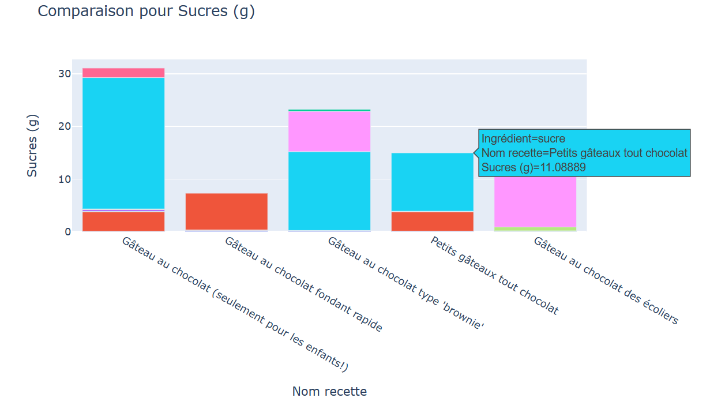
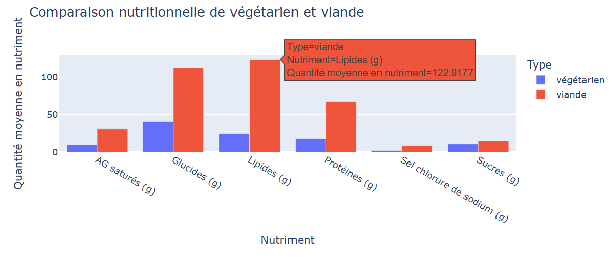
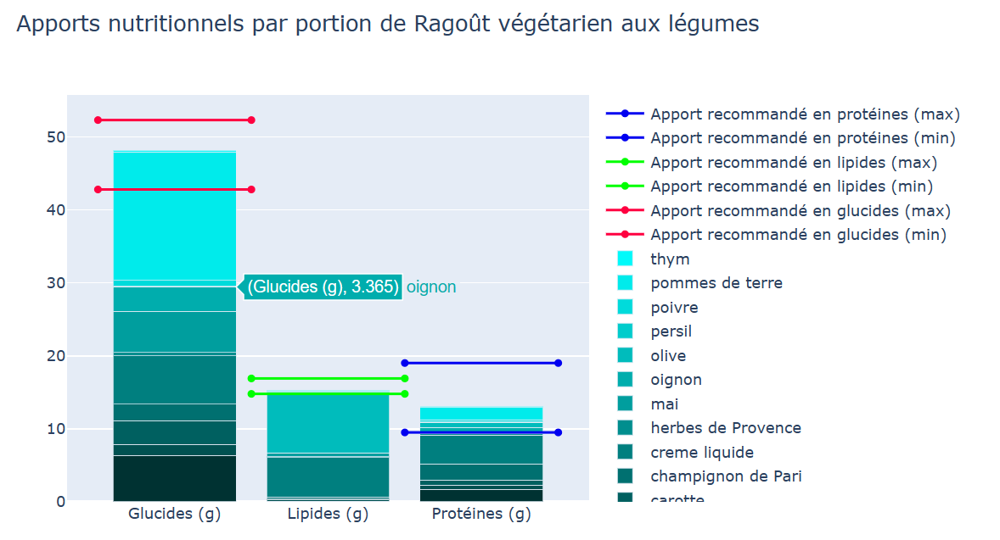
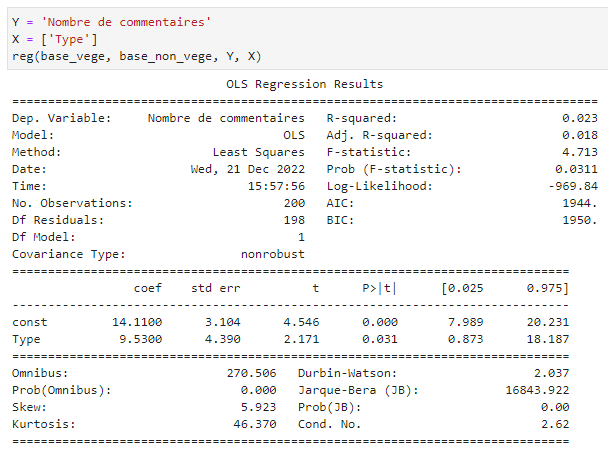
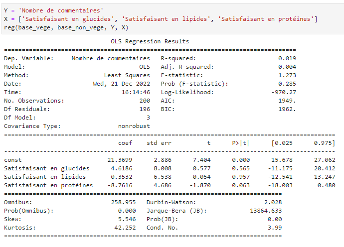

# **Evaluation of the nutritional quality of Marmiton recipes**

----------- Vous trouverez la version française dans `README_fr.md`-----------

ENSAE ParisTech 2022-2023 

Nathan GUESSE • Matthieu KRUBA • Marie-Olive THAURY

*This project is realized in the framework of the **Python for data-science (2A)** course of Lino GALIANA. It is supervised by Romain AVOUAC*.

## Introduction 

The aim of this project is to evaluate the nutritional quality of recipes promoted by the French cooking website [Marmiton](https://www.marmiton.org/). 
To do so, we will rely on the [Ciqual Table of nutritional composition of foods](https://ciqual.anses.fr/) which is a dataset produced by the *French Agency for Food, Environmental and Occupational Health & Safety* on the nutritional composition of foods. 

Even if the coded functions are generalizable to any type of recipe, we will pay particular attention to vegetarian recipes, compared to recipes with meat, the goal being to evaluate to what extent vegetarian recipes can be considered for a balanced and healthy diet. 

Finally, we will try to identify the nutritional factors that may explain the popularity of a recipe on Marmiton.  

## I) Retrieval of the recipes proposed by Marmiton for a search 

### Scrapping Marmiton 

The first step was to get the data from Marmiton. In the file `scrapping_marmiton.py` are all the necessary functions to extract these data. 

To scrape the data from Marmiton, we chose to perform a static scrapping thanks to the `BeautifulSoup` method. Compared to a dynamic scrapping, this technique had two advantages for us: 
1) first, having never done any scrapping before, this method was more affordable and easier to code. 
2) secondly, it completely ignores the presence of pop-up ads, which are present as soon as the home page is opened, and which may appear during the search. Not having to deal with these pop-ups allowed us to optimize the execution time of the algorithm because we did not need to use commands such as `time.sleep()`.

Scrapping the Marmiton data from a `'vegetarian'` search is done in three steps:

1) first, the `find_all_dishes` function finds the set of proposal pages matching the `'vegetarian'` search, a search page being a page on which about ten dishes are displayed: 

   

2) then, this same function retrieves from these proposal pages, the urls of the pages of the dishes proposed for the search `'vegetarian'` : 

   

3) finally, the `find_all_recipes` function retrieves thanks to the `find_recipe` function for each dish proposed for the search `'vegetarian'` : 
- the name of the recipe,
- the recipe (ingredients and quantities), 
- the number of people,  
- the number of comments. 

### Data cleaning and conversions 

In order to be able to use our data, we had to come back to a common unit for all ingredients, namely the gram. 

Fruits and vegetables being often indicated in numbers (for example, 3 pears), some liquids being given in liters (1/2 L of milk) or in kitchen unit of measure (for example, 2 tablespoons), one of the big difficulties was to format all these quantities in grams.

In the file `conversion_tools.py` you can find all the necessary functions for the cleaning of these data.

The file `references/Weights.txt` lists the ingredients and their associated gram values, for example "reblochon 500" or "shallot 40". 
The `references/Quantitators.txt` file lists a list of units and their associated value in grams, for example "bag 15" or "c.à.s 15" (tablespoon 15).

The `convert` function handles quantities whose unit is not expressed in grams. The function : 
1) detects quantities not denominated in grams,
2) browses the dictionary `dicopoids` (from the file `references/Poids.txt`) for the product name, 
3) browses the dictionary `dicoquantif` (from the file `references/Quantifiers.txt`) on the non-digital characters of the quantity given on Marmiton ("tablespoons" in "3 tablespoons").

*Note that these two dictionaries have been enriched with the function `what_s_missing` which detects the missing elements.* 

Then, the digital characters of the quantifier are multiplied by the corresponding value in the associated dictionaries. Thus for "3 tablespoons" we get 3x15 g, while for "3 pears" we get 3x120 g. 

For ingredients whose quantity is not specified and which do not appear in the dictionaries, a standard value is assigned. 

Finally, we delete the ingredients presenting a too specific quantity (`delete_exception`), we convert the quantities in `float` so that they are usable (`usable`) and we reduce to individual portions (`per_person`).

## II) Evaluation of the nutritional quality of recipes 

### Scrapping Ciqual 

Once the data from Marmiton was obtained, our objective was to merge these data with the nutritional data from the ANSES Ciqual database. For each ingredient of each recipe scanned on Marmiton, we wanted to obtain the global nutritional intake (caloric and energy intake), as well as the nutritional composition for some main nutrients (lipids, carbohydrates, proteins...).

To retrieve the desired data, we had two options: 
1) Either we downloaded the Excel file of the Ciqual database, which was free to access, and we searched ourselves for the entries that best corresponded to our ingredients, before manually selecting the desired variables.
2) Or we would directly scrape the Ciqual website, to retrieve only the desired data.

We opted for the second method, because it had several advantages: first, we benefited from Ciqual's search engine, and only had to make sure to formulate our search correctly to obtain an adequate result; for each search, we thus kept the first result. Secondly, the Ciqual site offered the possibility of directly consulting the abbreviated composition of the ingredient searched for, i.e. the main nutrients retained for our study. Finally, this method was of educational interest to us: the Ciqual site being dynamically coded, the scrapping required the use of `Selenium`.

In the file `scrapping_ciqual.py` you will find the `nutrition` function necessary to collect Ciqual data. Our scrapper works with the `chromedriver` browser. 

In practice, we encountered several problems with `Selenium`, which we were fortunately able to solve:
- The Ciqual database has two versions, one English and one French. As our searches were formulated with French names of ingredients, we had to program Selenium to switch to the French version of the site first. As the language change button does not always appear explicitly on the page (in particular, it disappears when the browser window shrinks), we used the driver's `execute_script` function rather than a simple `click`.
- The tags composing the source code of the Ciqual abbreviated data table all have a similar shape, without a unique attribute such as an identifier to differentiate them. To select only the desired data, we had to play with the structure of the page and the shape of the `xpath` of each desired element.
- The page loading time being sometimes longer than the program execution time, we sometimes had to implement pauses in the program execution (`time.sleep()`) to be sure to get the right data.

### Graphics

You will find in the file `main.py` all the functions necessary for the realization of the graphics. 

#### Comparison of several recipes from the same search for a nutritional criterion. 

Our first intention was to help the user to choose the best recipe among a list of Marmiton proposals for a common search. 

For example, the user is looking to cook a *vegetarian* dish while minimizing the sugar intake. For this, the graph associated with the `compare_recipe` function compares the different recipes proposed by Marmiton for *vegetarian*. By hovering over the graph, the user will even be able to access the sugar intake for each ingredient. 

   

#### Comparison of two types of dishes. 

Here, the objective is to help the user to choose between two types of meals. Let's imagine that he is hesitating between two meals: *vegetarian* or *meat*? 

Thanks to this graph, the user is able to compare the nutrient intake of two different meals. The associated `compare_food` function calculates the average nutrient intakes of each dish over N recipes, and then represents these intakes in a bar chart in a comparative way.

Thus, the user will know perfectly and immediately the average nutrient intakes of the recipes of the two types of meals.

   

#### A normative approach: vegetarian recipes and recommended nutrient intakes

We wanted to verify if the nutritional intakes of vegetarian recipes in terms of macronutrients (Fat, Carbohydrates and Protein) could be considered as satisfactory.

Throughout this section, the additional data we use as normative criteria (Satisfactory Fat, Protein and Carbohydrate Intake for an adult with low physical activity) are taken from an [ANSES report](https://www.anses.fr/fr/system/files/NUT2012SA0103Ra-2.pdf), published in 2016 as part of the French National Nutrition Health Program (PNNS). In particular, for an adult with low physical activity:
- The caloric intake of protein is considered satisfactory if it represents between 10 and 20% of the total caloric intake.
- The caloric intake of fat is considered satisfactory if it represents between 35 and 40% of the total caloric intake.
- The caloric intake of carbohydrates is considered satisfactory if it represents between 45 and 55% of the total caloric intake.

Based on these thresholds, we defined a balanced meal as having a satisfactory intake of each of the three macronutrients.

In order to convert the raw nutrient intake (in grams), which we have, into a percentage of the total caloric intake, a conversion of grams into calories is necessary, according to the following ratios:
- Protein: 1 g = 4 kcal
- Carbohydrates: 1 g = 4 kcal
- Fat: 1 g = 9 kcal

The `nutriStandard` function enables to visualize for a recipe the Fat, Carbohydrates and Protein macronutrients contained in the dish as well as the recommended thresholds, while the `nutriTest` function simply returns a Boolean indicating if the recipe is balanced or not.

   

## III) Popularity of a recipe according to its nutritional qualities:

Finally, in our project we wanted to study the popularity of recipes and try to identify factors that may influence this popularity. 

We chose as a measure of popularity the number of comments on the recipes. The average rating did not seem relevant to us since it indicated more the gustatory quality of a recipe rather than its popularity. Here, assuming that a constant fraction x of users give their opinion as soon as they try a recipe, then we can consider that the more opinions a recipe has, the more it has been tried by users. Moreover, the ratings given on Marmiton are generally between 4.5 and 5 stars and therefore the rating is not revealing in itself. On the other hand, the more the recipe is commented (= rated), the more relevant this rating is. 

The `reg` function present in `main.py` produces linear regressions.

We used the bases of 100 vegetarian recipes and 100 meat recipes that we scrapped. We added a binary variable named `type` which is 1 if the recipe contains meat, and 0 otherwise. 

The first regression was the number of comments on the presence of meat. Here, the presence of meat has a positive impact on the number of comments, with a significant coefficient at the 5% level. 

   

After the first regression, a doubt remained. We saw earlier that meat recipes were on average higher in protein than vegetarian recipes. Vegetarian recipes are often criticized for their lower protein content, which is perceived as their main defect. We therefore wanted to observe the impact of the presence of meat on the popularity of a recipe with the same protein content. To do this, we regressed the number of comments on protein content and the presence of meat. We note that the coefficient of the protein content is not significant at any usual threshold. The presence of meat, on the other hand, increases the number of comments on a recipe by 9, all other things being equal. This coefficient is significant at the 10% threshold. Here again, the presence of meat has a fairly significant effect on the number of comments. 

We then wanted to take into account the main nutrient contents to try to explain the popularity of a recipe. We therefore regressed the number of comments on the main nutrient contents and on the presence of meat. Here, the results are quite disappointing. The R² is very low, and above all, none of the coefficients is significant at the 10% threshold.

Finally, following the normative approach of part 2, we wanted to check if the fact that a recipe is healthier could have an influence on its popularity. Therefore, we performed a linear regression of the number of comments on the three binary variables `Protein satisfaction`, `Carbohydrates` and `Fat`. It appeared that the only significant coefficient in this regression (at the 10% threshold) is the one on protein. Moreover, this coefficient is negative: the fact that a recipe is healthy in protein decreases, all other things being equal, the number of comments by almost 9.

   

